# Ultra-low Dose PET Imaging Challenge
> This is an example of the PET imaging is used to recovere high-quality imaging from low dose scans imaging.

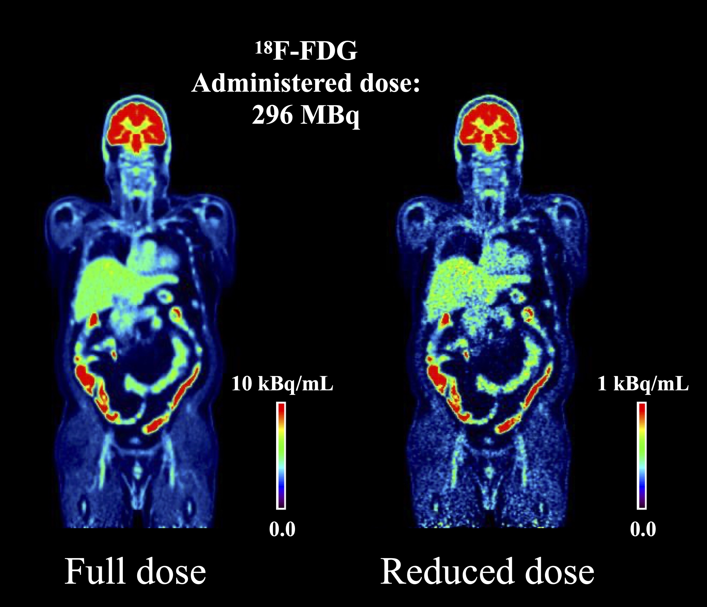

## Prerequisities
The following dependencies are needed:
- numpy >= 1.11.1
- SimpleITK >=1.0.1
- pytorch-gpu ==1.10.0
- pandas >=0.20.1
- scikit-learn >= 0.17.1

## How to Use
* 1、when download the all project,check out the data folder all csv,put your train data into same folder.or you can run lowdosePet2022data3dprepare.py to generate train data and validation data.
* 2、run lowdosePet_train.py for Unet3d training:make sure train data have effective path
* 3、run lowdosePet_inference.py for Unet3d inference:make sure validation data have effective path
* 4、run lowdosePet_inferencetest.py for Unet3d inference test:make sure test data have effective path

## Result

#  1-2 dose predict result
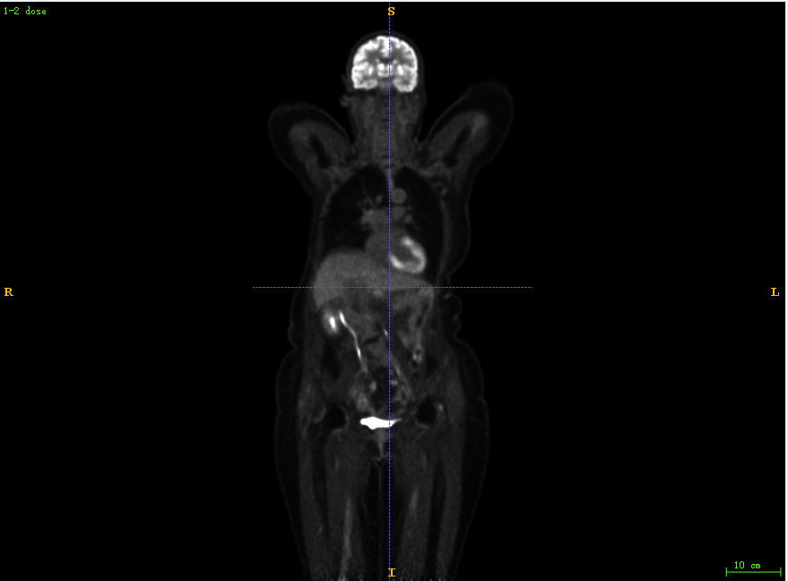
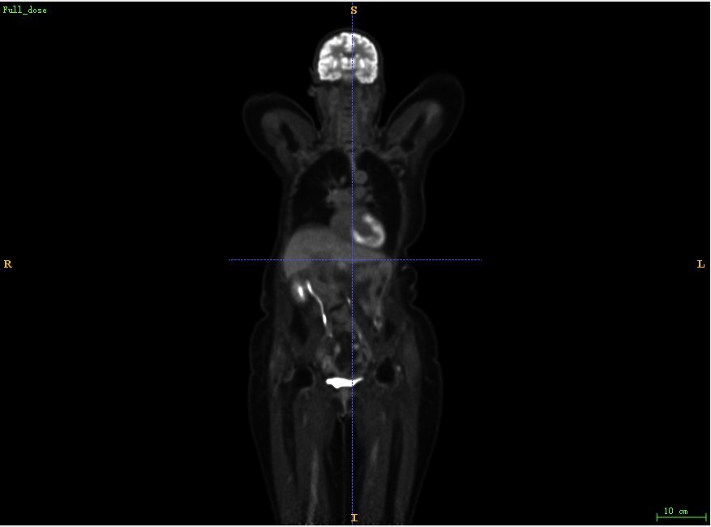
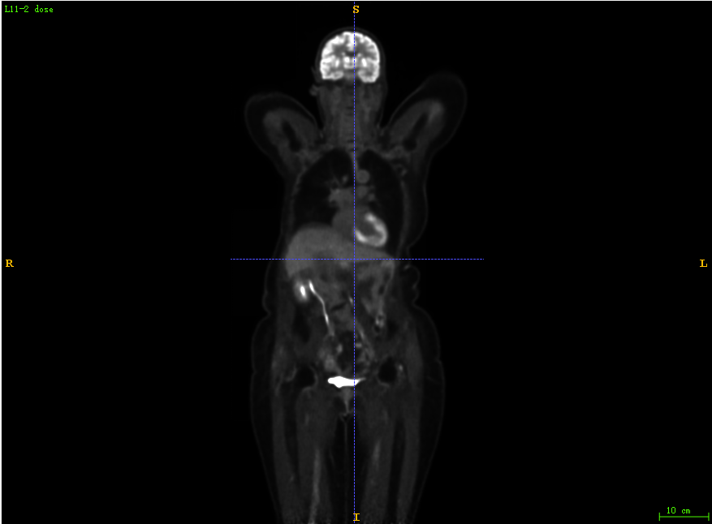
#  1-4 dose predict result
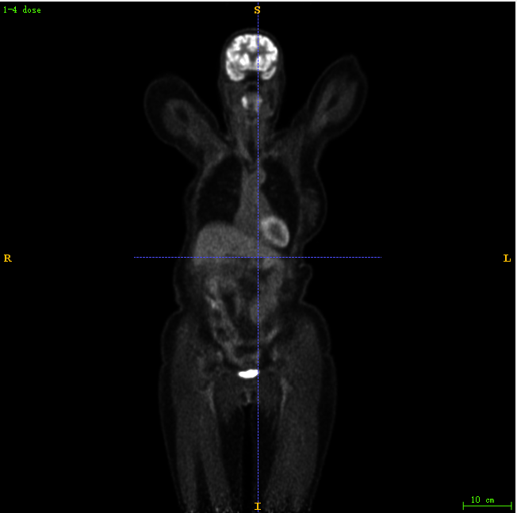

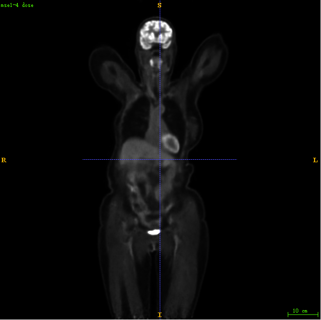
#  1-10 dose predict result
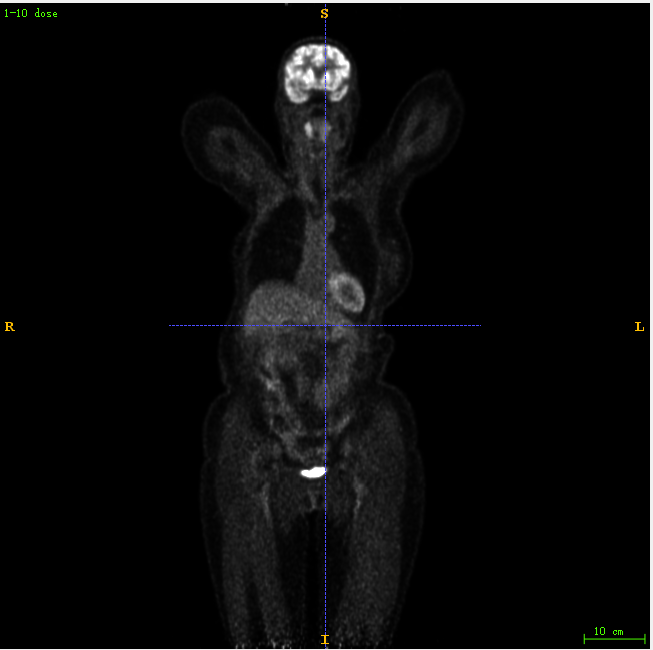

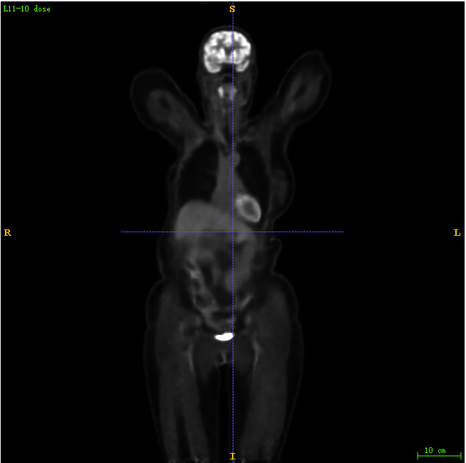
#  1-20 dose predict result
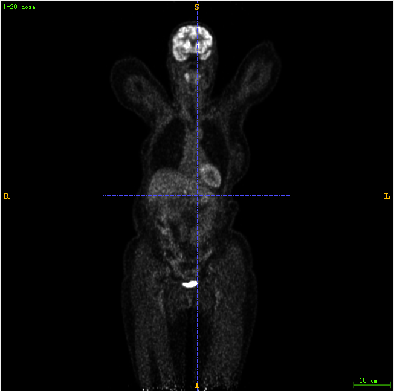

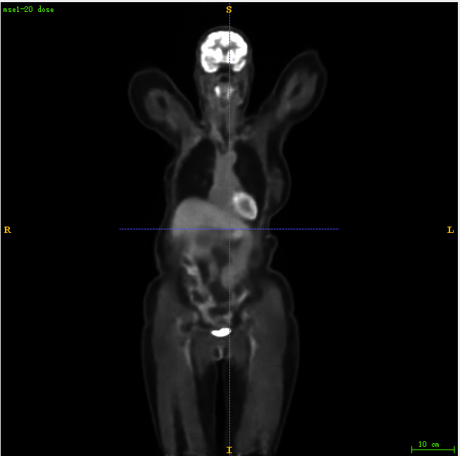
#  1-50 dose predict result
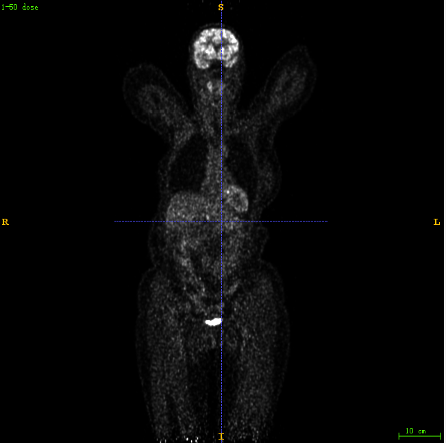

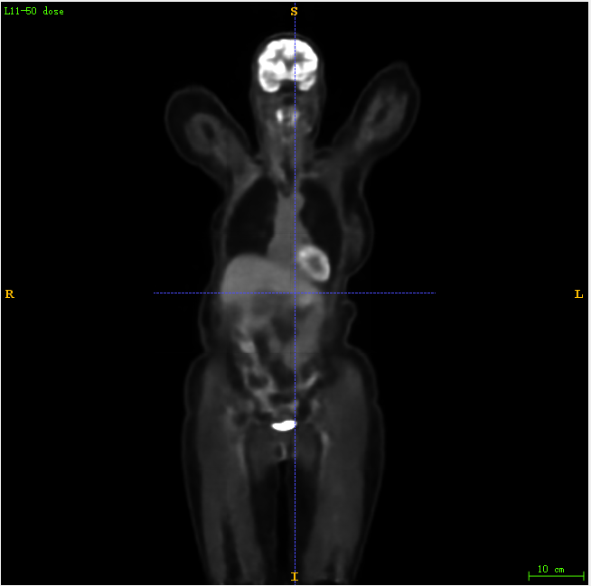
#  1-100 dose predict result
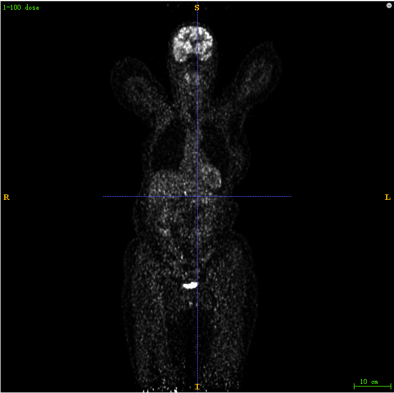

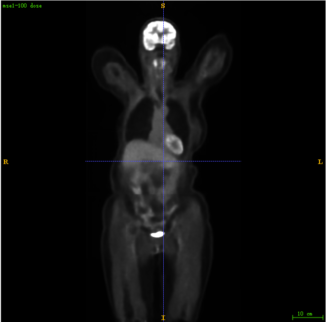

* you can find the trained model in log folder.
* more detail and trained model can follow my WeChat Public article.

## Contact
* https://github.com/junqiangchen
* email: 1207173174@qq.com
* Contact: junqiangChen
* WeChat Number: 1207173174
* WeChat Public number: 最新医学影像技术
